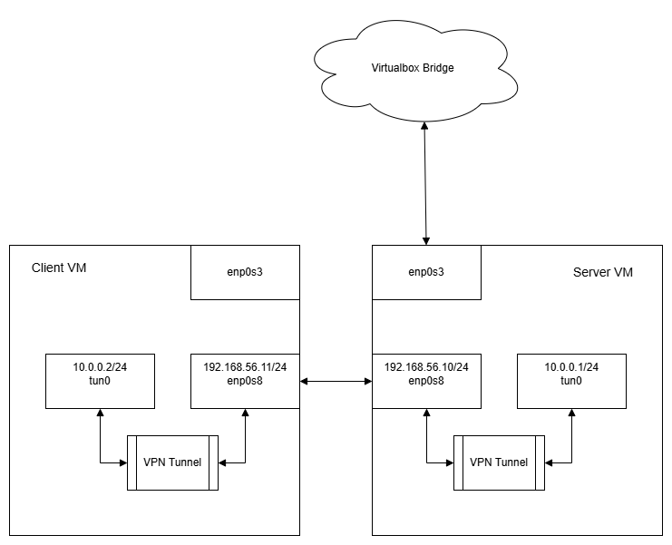
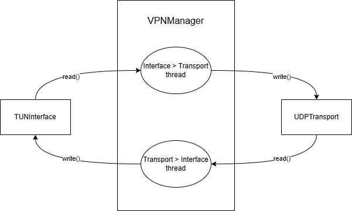

# Написание минимального VPN



В данном воркшопе мы создадим свой собственный минимальный VPN для связи двух Linux-машин.

## 1. Окружение

Для выполнения воркшопа нам понадобятся две виртуальные машины с установленной ОС Ubuntu 20.04. Мы используем Vagrant и VirtualBox для создания и управления виртуальными машинами.

- vpn-server: `192.168.56.10`
- vpn-client: `192.168.56.11`

Для запуска достаточно выполнить команду `vagrant up`.

Для подключения к виртуальным машинам можно использовать:
* `vagrant ssh vpn-server`
* `vagrant ssh vpn-client`

Текущая директория должна быть доступна в обоих машинах по пути `/vagrant`.

## 2. Архитектура ПО

Наш VPN состоит из следующих основных компонентов:
* VPNManager — менеджер, который связывает TUNInterface и UDPTunnel, перенаправляя трафик между ними.
* TUNInterface — Класс, реализующий взаимодействие с TUN интерфейсом.
* UDPTunnel — транспорт, который обеспечивает передачу пакетов между клиентом и сервером. В нашем примере все IP пакеты оборачиваются в UDP.



## 3. TUN/TAP интерфейсы

**TUN** (Network TUNnel) и **TAP** (Network TAP) — это виртуальные сетевые интерфейсы. TUN работает на уровне L3 (сетевой уровень) и оперирует IP-пакетами, тогда как TAP работает на уровне L2 (канальный уровень) и передаёт Ethernet-фреймы.

В нашем случае мы используем TUN-интерфейс для перехвата и отправки IP-пакетов.

Материалы:
* [TUN/TAP](https://www.kernel.org/doc/html/latest/networking/tuntap.html)
* [Гайд с пояснениями по созданию дескриптора](https://john-millikin.com/creating-tun-tap-interfaces-in-linux)

Основная идея заключается в том, чтобы открыть файл `/dev/net/tun` и настроить устройство при помощи ioctl. После этого полученный файловый дескриптор можно использовать для чтения и записи данных в интерфейс.

По умолчанию MTU интерфейса устанавливается в 1500 байт, поэтому можно не заботиться о размере буфера при реализации.

### Реазизуйте класс [TUNInterface](./vpn/tun.py)

```python
import fcntl
import os
import struct
from .base import TunnelInterface

class TUNInterface(TunnelInterface):
    TUNSETIFF = 0x400454ca
    IFF_TUN   = 0x0001
    IFF_NO_PI = 0x1000

    def __init__(self, name="tun0"):
        self.name = name
        self._setup_interface()

    def _setup_interface(self):
        """
        Настройка интерфейса
        """
        pass

    def read(self) -> bytes:
        """
        Чтение данных из интерфейса
        """
        pass

    def write(self, data: bytes) -> None:
        """
        Запись данных в интерфейс
        """
        pass

    def close(self) -> None:
        """
        Закрытие интерфейса
        """
        pass
```
<details>
  <summary>Решение</summary>
  
  ```python
  class TUNInterface(TunnelInterface):
    TUNSETIFF = 0x400454ca
    IFF_TUN = 0x0001
    IFF_NO_PI = 0x1000
    
    def __init__(self, name="tun0"):
        self.name = name
        self._setup_interface()
    
    def _setup_interface(self):
        """
        Настройка интерфейса
        """
        self.tun = open('/dev/net/tun', 'r+b', buffering=0)
        ifr = struct.pack('16sH', self.name.encode(), self.IFF_TUN | self.IFF_NO_PI)
        fcntl.ioctl(self.tun, self.TUNSETIFF, ifr)
    
    def read(self) -> bytes:
        """
        Чтение данных из интерфейса
        """
        return self.tun.read(2048)
    
    def write(self, data: bytes) -> None:
        """
        Запись данных в интерфейс
        """
        self.tun.write(data)
    
    def close(self) -> None:
        """
        Закрытие интерфейса
        """
        self.tun.close() 
  ```
</details>

## 4. UDP транспорт

Для передачи данных между клиентом и сервером мы используем UDP. Здесь реализация по аналогии с UDPBasedProtocol в первом домашнем задании. Обе стороны делают bind, слушают на локальный адрес и отправляют на удаленный.

### Реализация [UDPTransport](./vpn/udp.py)

```python:demos/vpn/vpn/udp.py
import socket
from .base import TunnelInterface

class UDPTransport(TunnelInterface):
    def __init__(self, local_addr: str, local_port: int, remote_addr: str, remote_port: int):
        self.socket = None 
        self.remote_addr = (remote_addr, remote_port)

    def read(self) -> bytes:
        """
        Чтение данных из UDP-сокета
        """
        pass

    def write(self, data: bytes) -> None:
        """
        Отправка данных через UDP-сокет
        """
        pass

    def close(self) -> None:
        """
        Закрытие сокета
        """
        pass
```
<details>
  <summary>Решение</summary>
  
  ```python
  class UDPTransport(TunnelInterface):
    def __init__(self, local_addr: str, local_port: int, remote_addr: str, remote_port: int):
        self.socket = socket.socket(socket.AF_INET, socket.SOCK_DGRAM)
        self.socket.bind((local_addr, local_port))
        self.remote_addr = (remote_addr, remote_port)
    
    def read(self) -> bytes:
        """
        Чтение данных из UDP-сокета
        """
        data, _ = self.socket.recvfrom(2048)
        return data
    
    def write(self, data: bytes) -> None:
        """
        Отправка данных через UDP-сокет
        """
        self.socket.sendto(data, self.remote_addr)
    
    def close(self) -> None:
        """
        Закрытие сокета
        """
        self.socket.close() 
  ```
</details>

## 5. Настройка интерфейсов и первый запуск

На данном мы готовы запустить наш туннель и проверить прямое соединение между клиентом и сервером.

Клиент:
```sh
sudo python3 main.py --interface-name tun0 \
  --local 192.168.56.11:5000 \
  --remote 192.168.56.10:5000 \
  --debug
```
Сервер:
```sh
sudo python3 main.py --interface-name tun0 \
  --local 192.168.56.10:5000 \
  --remote 192.168.56.11:5000 \
  --debug
```
Интерфейсы tun0 у нас эфемерные и существуют только пока запущен процесс main.py. Поэтому открываем по второму терминалу к каждой машине и выполняем следующие команды для назначения IP-адреса и включения интерфейса:

Клиент:
```sh
ip addr add 10.0.0.2/24 dev tun0
ip link set tun0 up
```

Сервер:
```sh
ip addr add 10.0.0.1/24 dev tun0
ip link set tun0 up
```

Проверить работоспособность можно, выполнив команду `ping 10.0.0.1` на клиенте и `ping 10.0.0.2` на сервере.

На данном этапе мы можем передавать данные между машинами, осталось настроить маршрутизацию и NAT.

## 6. Настройка клиента


Клиенту для работы с VPN нужно настроить маршрутизацию. Мы хотим использовать адрес сервера внутри туннеля как маршрут по умолчанию.

В нашем примере с виртуальными машинами это не проблема, так как они находятся в одной подсети. Если же мы находимся в разных подсетях с нашим впн сервером, то при отсутствии маршрута по умолчанию нам нужно явно указать, что до VPN сервера дорога лежит через "старый" маршрут по умолчанию.

```sh
# SERVER_PUBLIC_IP=???
# DEFAULT_ROUTE=$(ip route show default | awk '/default/ {print $3}')
# ip route add ${SERVER_PUBLIC_IP}/32 via ${DEFAULT_ROUTE}
```
Далее мы настраиваем маршрут по умолчанию через туннель.
```sh
ip route del default
ip route add default via 10.0.0.1
```

## 7. Настройка сервера

На сервере нам нужно научиться распаковывать пакеты из туннеля и отправлять их в интернет. Для этого нужно настроить NAT и разрешить форвардинг.

Находим основной интерфейс, который используется для выхода в интернет:
```sh
MAIN_INTERFACE=$(ip route get 8.8.8.8 | awk '{print $5; exit}')
```

Настраиваем NAT:
```sh
iptables -t nat -A POSTROUTING -s ${TUN_NETWORK} -o ${MAIN_INTERFACE} -j MASQUERADE
```

Разрешаеми и настраиваем форвардинг:
```sh
echo 1 > /proc/sys/net/ipv4/ip_forward
iptables -A FORWARD -i ${TUN_NAME} -o ${MAIN_INTERFACE} -j ACCEPT
iptables -A FORWARD -i ${MAIN_INTERFACE} -o ${TUN_NAME} -m state --state RELATED,ESTABLISHED -j ACCEPT

```

## 8. Проверка работы

Теперь все должно работать. Проверьте, что трафик проходит через туннель.

На клиенте выполним:

```sh
ping 8.8.8.8
```
В логах сервера должны появиться пакеты, которые прошли через туннель. Обратите внимание на увеличение задержки.

Также можно воспользоваться утилитой `traceroute` для проверки маршрута пакетов.

```sh
traceroute 8.8.8.8
```
