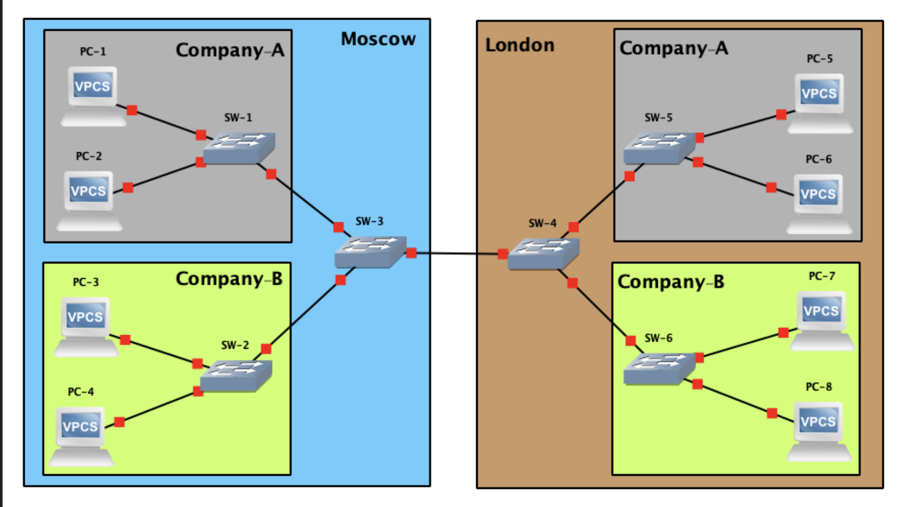
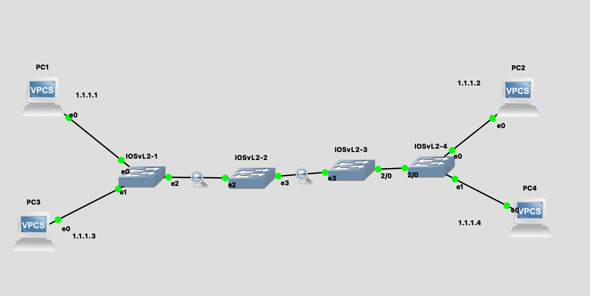

# Лабораторная 2: VLAN + QinQ





## Настройка оборудования
Нам потребуется IOSvL2 свич. Использует qemu для работы, самая тяжелая и медленная железка в рамках этого курса.

Свич качать тут: https://drive.google.com/drive/folders/1Yo9V9vUJDkjWOtguarChq-nRKWoFT5m5

Рекомендованный RAM: 768 MB
Минимальный RAM:     400 MB

Гайд по установке: https://www.youtube.com/watch?v=vWvXKXas8WA&feature=emb_logo
```shell
# В этом образе в режим "рута" следует перейти командой enable
enable
```
## Port Security
Не нужно в лабе, для общего развития.
```shell
# Показать таблицу привязки MAC адресов к портам
show mac address-table

Внутри интерфейса:
    # port security доступен только для access портов
    switchport mode access
    # Включить port-security на данном порту
    switchport port-security
    # Задать максимальное количество мак адресов на порту
    switchport port-security maximum 1
    # Зафиксировать адрес 00:00:00:00:00:00 на текущемпорту
    switchport port-security mac-address 00:00:00:00:00:00
    # задать sticky режим порту
    switchport port-security mac-address sticky 
    # задать действие в случае нарушения
    switchport port-security violation { shutdown | restrict | protect }
```

# VLAN 802.1q
```shell
# показать инфо по вланам
show vlan brief

# включить вланы в режиме конфигурации
vlan 2,3

# настройка access интерфейса
    switchport access vlan 2

# настройка trunk интерфейса
    switchport trunk encapsulation dot1q
    switchport mode trunk
    switchport trunk allowed vlan 2,3 # опционально
```

# QinQ


Пример конфигурации свичей


1 - 2 - 3 - 4


```shell
show dot1q-tunnel
show spanning-tree vlan 123


# настройка интерфейса 1 в сторону 2 или 4 в сторону 3
    switchport trunk encapsulation dot1q
    switchport mode trunk
    switchport trunk native vlan 123

# настройка интерфейса 2 в сторону 1 или 3 в сторону 4
    switchport access vlan 123
    switchport mode dot1q-tunnel

# настройка интерфейса между 2 и 3
    switchport trunk encapsulation dot1q
    switchport mode trunk

#
```
