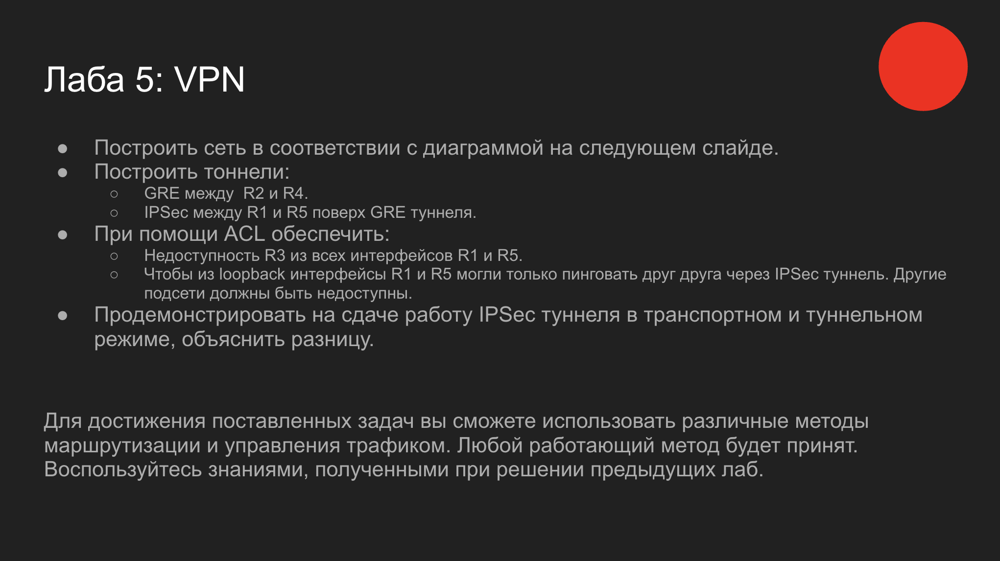
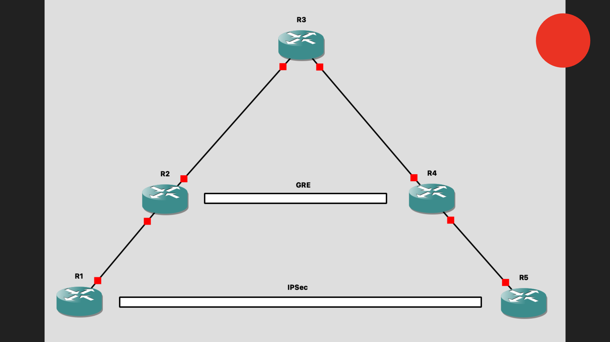
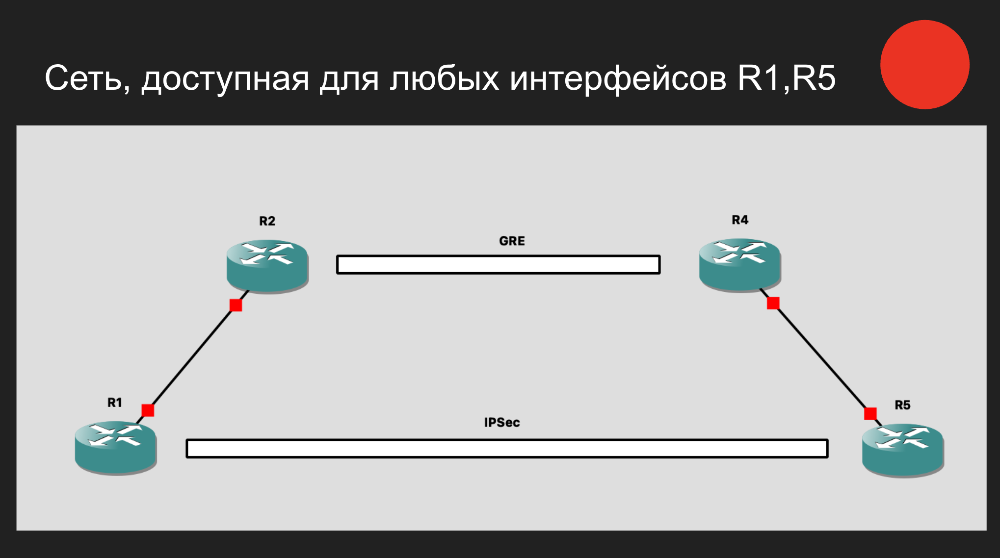
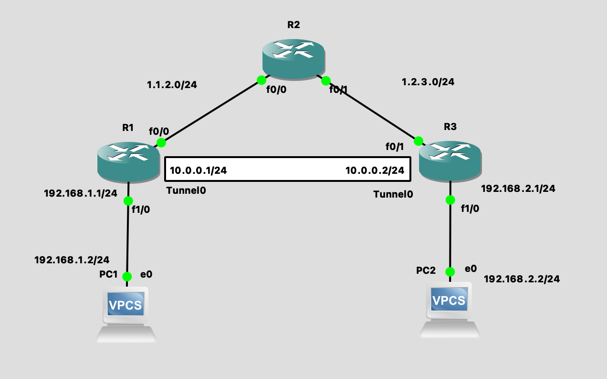
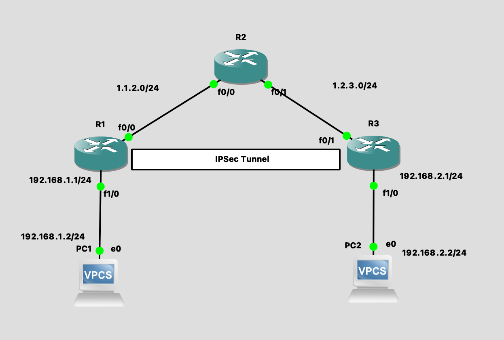

# Лабораторная 5: VPN






# GRE



R1
```sh
ip route 192.168.2.0 255.255.255.0 10.0.0.2


interface Tunnel0

    ip address 10.0.0.1 255.255.255.0

    tunnel source 1.1.2.1

    tunnel destination 1.2.3.3
```

R3
```sh
ip route 192.168.1.0 255.255.255.0 10.0.0.1

interface Tunnel0

    ip address 10.0.0.2 255.255.255.0

    tunnel source 1.2.3.3

    tunnel destination 1.1.2.1
```


# IPSec



В отлчиче от GRE нам важно существование маршрута до stub подсетей. Это нужно из-за того, что шифрование применяется как самый последний шаг после отправки пакета, после маршрутизации.

Также как и в прошлом примере предполагаем существование маршрута между R1 и R3.
```sh
# Текущие сессии шифрования
sh crypto session
# активные SA
sh crypto isakmp sa
```

R1
```sh

# Политики будут перебираться по номеру, начиная с 1. Наша политика простая: просто использовать пароль
crypto isakmp policy 1
 authentication pre-share

# Для соседа 1.2.3.3 зададим пароль "cisco"
crypto isakmp key cisco address 1.2.3.3

# Перечислим доступные алгортмы шифрования
crypto ipsec transform-set AES128-SHA esp-aes esp-sha-hmac

# crypto map MAP1 - настройки конкретного тоннеля
crypto map MAP1 10 ipsec-isakmp
 set peer 1.2.3.3
 set transform-set AES128-SHA
 # применять только к пакетам, соответствующим access-list'у 101
 match address 101

interface FastEthernet0/0
 ip address 1.1.2.1 255.255.255.0
 # Применяем шифрование для пакетов, проходящих через этот интерфейс
 crypto map MAP1

# access-list, с помощью которого мы выбираем какие пакеты шифровать
access-list 101 permit ip 192.168.1.0 0.0.0.255 192.168.2.0 0.0.0.255

# Очень важно. Пакет должн быть маршрутизируемым еще до инкапсуляции.
ip route 192.168.2.0 255.255.255.0 1.2.3.3

```

R3
```sh

# Политики будут перебираться по номеру, начиная с 1. Наша политика простая: просто использовать пароль
crypto isakmp policy 1
 authentication pre-share

# Для соседа 1.1.2.1 зададим пароль "cisco"
crypto isakmp key cisco address 1.1.2.1

# Перечислим доступные алгортмы шифрования
crypto ipsec transform-set AES128-SHA esp-aes esp-sha-hmac

# crypto map MAP1 - настройки конкретного тоннеля
crypto map MAP1 10 ipsec-isakmp
 set peer 1.1.2.1
 set transform-set AES128-SHA
 # применять только к пакетам, соответствующим access-list'у 101
 match address 101

interface FastEthernet0/0
 ip address 1.2.3.3 255.255.255.0
 # Применяем шифрование для пакетов, проходящих через этот интерфейс
 crypto map MAP1

# access-list, с помощью которого мы выбираем какие пакеты шифровать
access-list 101 permit ip 192.168.2.0 0.0.0.255 192.168.1.0 0.0.0.255

# Очень важно. Пакет должн быть маршрутизируемым еще до инкапсуляции.
ip route 192.168.1.0 255.255.255.0 1.1.2.2

```

Переключение между транспортным и туннельным режимом IPSec
```sh
# редактируем часть конфига нашего transport-set
crypto ipsec transform-set AES128-SHA esp-aes esp-sha-hmac
    mode tunnel
    # ИЛИ
    mode transport
```
